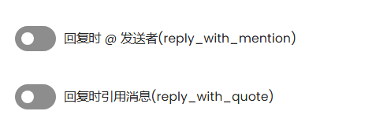
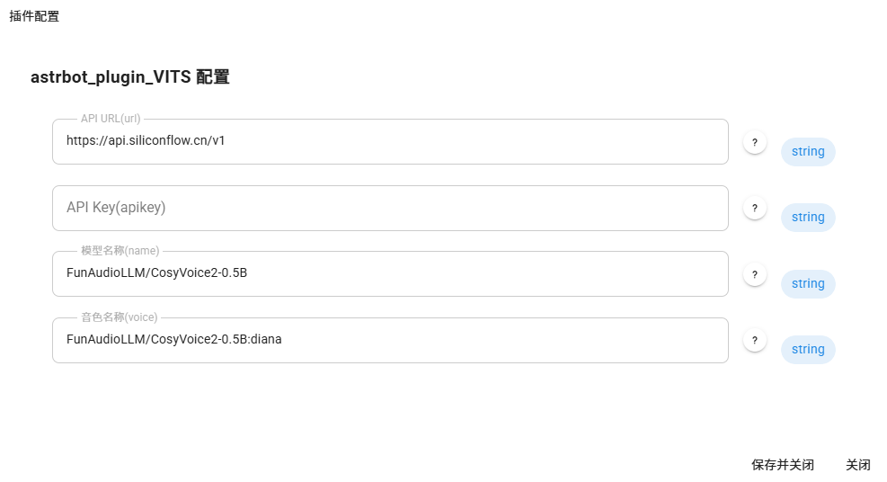

# **Astrbot_Plugin_VITS**

# Docker部署没法用

## 切记不要开原来的TTS

## @和回复会吞语音，需要关闭

## 调用硅基流动API实现文本转语音插件。

## 需要在插件面板中配置以下内容：
- **URL**
- **API Key**
- **模型名字**
- **音色**

## URL 末尾要加/v1
**`https://api.siliconflow.cn/v1`**

## 音色前需要加上模型名字，用英文冒号隔开

如 ：使用alex音色，

FunAudioLLM/CosyVoice2-0.5B模型，

则name配置为：`FunAudioLLM/CosyVoice2-0.5B`

则voice配置为：`FunAudioLLM/CosyVoice2-0.5B:alex`

## 目前仅支持官方预置音色

### 男生音色：

- **沉稳男声**: alex
- **低沉男声**: benjamin
- **磁性男声**: charles
- **欢快男声**: david

### 女生音色：

- **沉稳女声**: anna
- **激情女声**: bella
- **温柔女声**: claire
- **欢快女声**: diana

# /vits 启用或者禁用插件（插件默认禁用）

# 未来可能支持本地GPT sovits

## 有什么好玩的想法可以来找我吖
### 不会用也欢迎找我

**（作者是初学者，欢迎大家提意见，反馈bug。）**